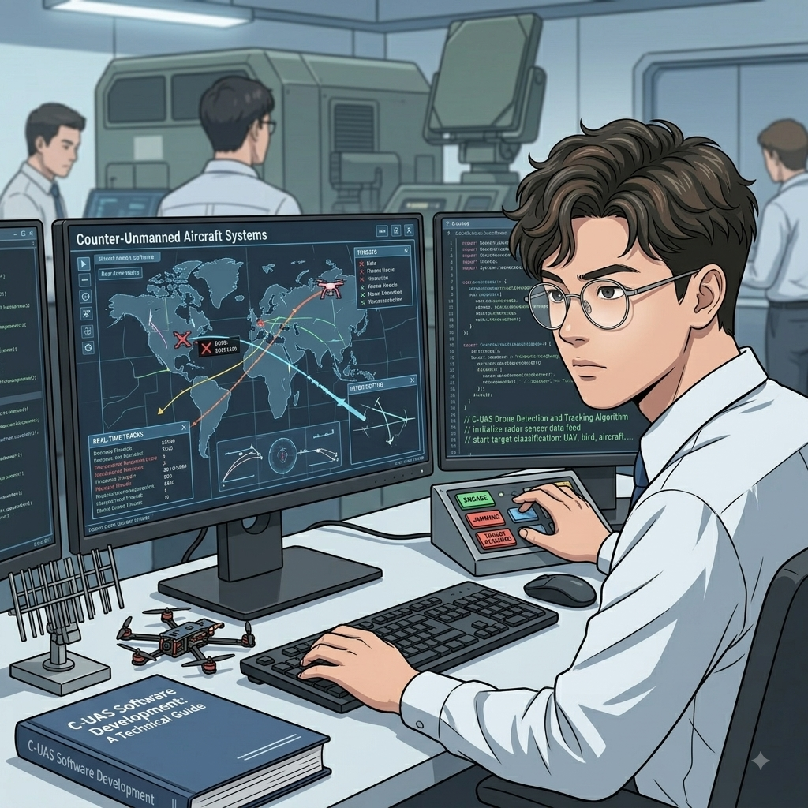

<h1 align="center">
  Hi 👋, I'm Nguyen The Loc (Eithan)
</h1>

<h3 align="center">
  Software Engineer | Full-Stack • Embedded Systems • AIoT
</h3>

  Building software that connects <b>web, mobile, backend, embedded systems, and hardware</b>.

  
  <!--  -->

  

I'm a **Software Engineer** with a strong interest in building systems across the entire technology stack — from **embedded devices and hardware interfaces to backend services and modern web applications**.

My experience spans:

- 🌐 Full-Stack Web & Mobile Development
- ⚙️ Backend & Distributed Services
- 🔌 Embedded Systems & Hardware Integration
- 📡 IoT, RF & Real-Time Systems
- 🛰️ Command & Control (C2) platforms
- 🛡️ C-UAS / Defense Technology Software
- 🤖 AIoT & Computer Vision
- 🗄️ Database & Multi-Tenant Systems

I enjoy working on problems where **software meets hardware**, especially when building systems that need to communicate with real-world devices.

 
 
 

###

###

## 💻 My Main Skills:

<table align="center">
    <tr>
        <td align="center" width="96">
            
             Go
        </td>
        <td align="center" width="96">
            
             Python
        </td>
        <td align="center" width="96">
            
             C++
        </td>
        <td align="center" width="96">
            
             C
        </td>
        <td align="center" width="96">
            
             TypeScript
        </td>
       <td align="center" width="96">
            
             JavaScript
        </td>
      <td align="center" width="96">
            
             Node.js
        </td>
    </tr>
    <tr>
        <td align="center" width="96">
            
             React
        </td>
        <td align="center" width="96">
            
             Next.js
        </td>
        <td align="center" width="96">
            
             Tailwind
        </td>
        <td align="center" width="96">
            
             Flutter
        </td>
        <td align="center" width="96">
            
             Electron
        </td>
        <td align="center" width="96">
            
             Opencv
        </td>
      <td align="center" width="96">
            
             Tensorflow
        </td>
    </tr>
  <tr>
        <td align="center" width="96">
            
             Postgres
        </td>
        <td align="center" width="96">
            
             SQLite
        </td>
        <td align="center" width="96">
            
             Supabase
        </td>
     <td align="center" width="96">
            
             Mongodb
        </td>
      <td align="center" width="96">
            

        </td>
        <td align="center" width="96">
            
             Linux
        </td>
     <td align="center" width="96">
            
             Dart
        </td>
    </tr>
</table>
  

## 🚀 What I'm Working On

### 🛰️ C-UAS Command & Control

Developing software platforms for **Counter-Unmanned Aircraft Systems (C-UAS)**, integrating multiple device types and real-time data streams.

Working with technologies such as:

- Go / Echo
- React / Next.js
- TypeScript
- SAPIENT Protocol
- REST / gRPC
- MQTT
- SSE
- SQLite / PostgreSQL
- RF Sensors
- EO Cameras
- PTU
- RF Jammers

### 🌱 AIoT & Embedded Systems

Exploring the intersection of **embedded systems, IoT, automation and software platforms**, including projects built with:

- M5Stack
- C / C++
- Python
- MQTT
- Sensors & actuators
- Computer vision
- Cloud / backend services

---

<!-- 

  

 -->
